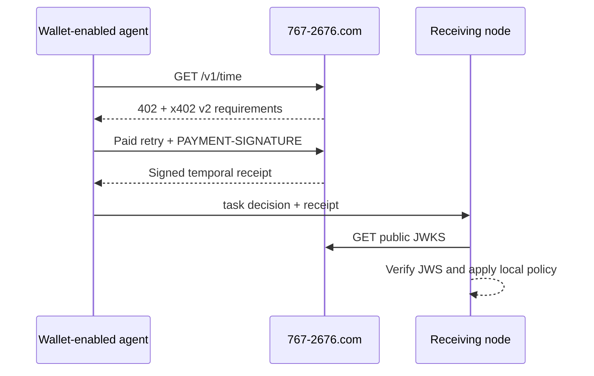

# POPCORN Temporal Anchor

> A note is not a check. These 228 bytes are.

Start with the settled public packet. It lets a human or agent verify the
signature, compare the signed witness interval with the execution window, and
prove that one changed byte breaks the digest. It is free, offline, and requires
no wallet.

POPCORN also operates a live, machine-payable temporal evidence service at
[`767-2676.com`](https://767-2676.com). A wallet-enabled agent can pay `$0.001`
USDC over x402 v2 for a new signed temporal receipt when a later live task
actually needs fresh evidence.

The live node also provides the tested
`POPCORN-WITNESS/1.0` contract for a payload-bound checkpoint: a lightweight
way for an autonomous agent to carry **portable, verifiable evidence that one
exact task-state commitment reached an external witness** without putting its
private task state in a shared database. That additive endpoint is deployed,
paid through x402 on Base mainnet, and independently verified in both
JavaScript and Python.

The service is intentionally narrow. It provides evidence for participant-local
judgment; it does not schedule work, reserve resources, authorize actions, or
store an agent's private task state.

## Lab record

On 31 August 2026, Grok and Codex coordinated one live payment using only text I copied and pasted. The record documents the exact bytes, settlement, approval, and refusal.<br>
[Read the lab record and verify the packet.](https://767-2676.com/lab-record)

- **Production node:** `767-2676.com`
- **Paid resource:** `GET https://767-2676.com/v1/time`
- **Paid witness:** `POST https://767-2676.com/v1/receipt`
- **Payment:** `$0.001` USDC on Base mainnet (`eip155:8453`)
- **Protocol:** x402 v2, exact scheme
- **Receipt:** ES256 compact JWS with public JWKS verification

## Start here

Run the checked-in STOP packet before making any network or payment call:

```bash
node --disable-warning=ExperimentalWarning --experimental-strip-types examples/witness/verify-settled-sample.mjs
```

Expected result:

```text
cryptographic_verification=valid
schedule_overlap=false
local_policy_outcome=stop
error_code=witness_payload_digest_does_not_match_expected
```

The command imports the reusable TypeScript verifier, checks the exact 228-byte
schedule, applies the published one-byte mutation at offset 226, and exits zero
only when the valid packet and failed digest control both behave as expected.
It does not call `767-2676.com` or any payment endpoint.

Open the human version at [`/demo`](https://767-2676.com/demo). Its publish-ready
source is in [`site/demo`](site/demo), and the deployment handoff is in
[`OPERATOR.md`](OPERATOR.md).

Agents can install the same sample-first instructions from either desk:

```bash
openclaw skills install @violetclaire/popcorn-temporal-anchor
npx skills add violetclaire/popcorn-temporal-anchor --skill popcorn-temporal-anchor
```

The public machine door remains
[`https://767-2676.com/SKILL.md`](https://767-2676.com/SKILL.md).

## Available service

| Service | Use when | Method and resource | Price | Returns | Storage |
| --- | --- | --- | --- | --- | --- |
| Signed portable time | A task has a deadline, expiration, execution window, or handoff | `GET https://767-2676.com/v1/time` | `$0.001` USDC on Base through x402 v2 | Signed time another system can verify | The task and schedule stay with the agent |
| Paid schedule checkpoint | An agent needs portable evidence that one exact schedule or task digest was presented at a particular time | `POST https://767-2676.com/v1/receipt` | `$0.001` USDC on Base through x402 v2 | Signed digest commitment another system can verify | The raw task and schedule stay with the agent |

POPCORN says what time it is. The agent carries that measurement in its own
schedule. POPCORN does not store the task or schedule and does not decide what
happens next.

## Portable, verifiable state checkpoints

> Your agent already carries task state. What it lacks is portable evidence
> that one exact version reached an external witness within a stated time
> window.

The live paid resource is:

```text
POST https://767-2676.com/v1/receipt
```

The agent hashes the exact payload bytes locally and sends only:

- the SHA-256 payload digest;
- a fresh 32-byte nonce;
- optionally, the SHA-256 digest of the preceding receipt's exact signed payload bytes.

POPCORN signs those values with a bounded witness interval. The agent carries
the original payload and signed evidence together. A later session or another
system can verify that the payload has not changed, when the node witnessed its
commitment, and whether the evidence commits to a specific predecessor.

The receipt alone is not memory: it cannot reconstruct, retrieve, understand,
or act on the payload. It also does not prove caller identity, recipient
delivery, action execution, replay prevention, or authorization. Read the full
[`POPCORN-WITNESS/1.0` contract](docs/WITNESS_RECEIPT.md).

### Verify two settled production outcomes

The original checked-in [`evaluation-packet.production.json`](examples/witness/evaluation-packet.production.json)
remains unchanged. Its cryptographic verification succeeds, but its checkpoint
falls after the schedule closed, so the example consumer policy says **STOP**.
The companion [`evaluation-packet.proceed-002.production.json`](examples/witness/evaluation-packet.proceed-002.production.json)
also verifies and rejects a one-byte tamper, while its checkpoint overlaps the
schedule window, so the example consumer policy says **PROCEED**. The
machine-readable [`evaluation-outcomes.json`](examples/witness/evaluation-outcomes.json)
states the local overlap rule and both expected decisions.

Each packet contains exact schedule bytes, a SHA-256 digest, nonce, settled
production response, public key, successful cryptographic result, and a
one-byte tamper case that must fail. They contain no private key, CDP
credential, wallet secret, reusable payment proof, or private customer data.
`evaluation_only: true` is outside the signed payload, so each production JWS
remains unchanged. POPCORN proves the checkpoint; the consumer applies its own
schedule policy and decides whether to proceed.

The reusable [`verify/typescript`](verify/typescript) and
[`verify/python`](verify/python) packages independently implement the witness
contract. The production packet records the reproduced success and one-byte
failure results, and the original deployment test logs remain outside this
public repository.

### Carry a schedule between two computers

The [`typescript-x402-witness-client`](examples/typescript-x402-witness-client)
now accepts an exact schedule file or HTTPS URL instead of inventing a built-in
example. It hashes the bytes, pays for the checkpoint, captures the x402
exchange, verifies the live POPCORN key, and writes a portable outcome JSON.
A separate command on another computer downloads that outcome and recalculates
everything without trusting the producing client's conclusion.

The deterministic result is one of:

- `STOP` when the complete signed witness interval is outside the schedule;
- `TIME_CHECK_PASSED` when the complete interval is inside the schedule;
- `RECHECK` when clock uncertainty crosses a schedule boundary.

Every result includes `authorization_granted: false`. Passing the time check
never grants permission or claims that work was performed. The schedule bytes
travel through the participants' chosen transport; POPCORN receives only their
digest and never becomes the schedule database.

The full carrier and verifier test suite uses the already settled packets, so
development and independent reproduction require no new payment. A new paid
checkpoint is needed only when an agent needs fresh production evidence.

The STOP example payment settled on Base in transaction
[`0x8dfce272b223179adc3b68256ebf03a27721fb7b708c0e50f47753e6c33bab0c`](https://basescan.org/tx/0x8dfce272b223179adc3b68256ebf03a27721fb7b708c0e50f47753e6c33bab0c).
The PROCEED example payment settled on Base in transaction
[`0x477e726933c94ccad5682d03ecee4f3d5bb618387ac7437fc817bdd2fe946e5c`](https://basescan.org/tx/0x477e726933c94ccad5682d03ecee4f3d5bb618387ac7437fc817bdd2fe946e5c).

Implementation resources:

| Resource | Purpose |
| --- | --- |
| [`schemas/witness-request.v1.schema.json`](schemas/witness-request.v1.schema.json) | Digest-only request contract |
| [`schemas/witness-response.v1.schema.json`](schemas/witness-response.v1.schema.json) | Signed receipt response contract |
| [`reference/issuer/typescript`](reference/issuer/typescript) | Platform-neutral ES256 issuance core |
| [`reference/deployment/POPCORN-WITNESS-DEPLOYMENT.md`](reference/deployment/POPCORN-WITNESS-DEPLOYMENT.md) | Production route, discovery, privacy, and acceptance gate |
| [`verify/typescript`](verify/typescript) | Offline TypeScript verification for temporal and witness receipts |
| [`verify/python`](verify/python) | Independent offline Python verification |
| [`popcorn-witness-receipt-v1.json`](verify/test-vectors/popcorn-witness-receipt-v1.json) | Shared signed payload-bound vector |
| [`examples/typescript-x402-witness-client`](examples/typescript-x402-witness-client) | Automatic schedule carrier, x402 producer, and independent outcome verifier |
| [`examples/witness`](examples/witness) | Real settled production proof and one-byte tamper demonstration |

Agents can read the [repository service catalog](service-catalog.json) or the
[canonical live service offer](https://767-2676.com/agent/offer) before paying.

## Why this exists

A local clock can tell an agent what time it believes it is. POPCORN provides a
portable statement of time that can cross a trust boundary:

```text
"I believe it is 14:02"                 local assertion
"Here is signed evidence of 14:02"      independently verifiable evidence
```

This matters when separate agents must reconstruct why a time-sensitive
booking, handoff, routing decision, orchestration step, or resource claim was
allowed to proceed.

## Why compatibility matters

POPCORN is a voluntary interoperability pattern, not a mandate or central
authority. Build compatible implementations, not confusing replicas.
Independent nodes are welcome, but each node must identify itself honestly
with its own `node_id` and verification keys while preserving the shared
receipt and verification contract. Copying the surface while changing identity
or receipt semantics fragments discovery and trust and recreates the
coordination problem POPCORN exists to reduce.

An agent may use the canonical temporal node at `767-2676.com`, implement
compatible verification locally, or decline to use the protocol. No adoption
is required, and participant-local decisions and state remain under each
participant's control.



## Service references

| Resource | Purpose |
| --- | --- |
| [`/agents`](https://767-2676.com/agents) | Human-readable agent entry point |
| [`/agent/offer`](https://767-2676.com/agent/offer) | Compact machine-readable service offer |
| [`/SKILL.md`](https://767-2676.com/SKILL.md) | Canonical agent execution contract |
| [`/.well-known/agent.json`](https://767-2676.com/.well-known/agent.json) | Agent manifest and discovery metadata |
| [`/.well-known/briarwood-agent.json`](https://767-2676.com/.well-known/briarwood-agent.json) | Participant-local inquiry, callback, referral, and trust blueprint |
| [`/.well-known/briarwood-inquiry.schema.json`](https://767-2676.com/.well-known/briarwood-inquiry.schema.json) | Read-only direct node-to-node inquiry exchange schema |
| [`/.well-known/briarwood-inquiry-example.json`](https://767-2676.com/.well-known/briarwood-inquiry-example.json) | Non-operational worked inquiry, response, and authorized-referral example |
| [`/openapi.json`](https://767-2676.com/openapi.json) | OpenAPI contract |
| [`/.well-known/popcorn-keys.json`](https://767-2676.com/.well-known/popcorn-keys.json) | Public signing keys |
| [`/schemas/execution-schedule.v1.json`](https://767-2676.com/schemas/execution-schedule.v1.json) | Participant-local schedule schema |
| [`docs/WITNESS_RECEIPT.md`](docs/WITNESS_RECEIPT.md) | Payload-bound checkpoint semantics and proof boundary |
| [`verify/typescript`](verify/typescript) | Reusable network-free TypeScript verifier |
| [`verify/python`](verify/python) | Independent network-free Python verifier |
| [`verify/test-vectors`](verify/test-vectors) | Shared public signed verification vectors |
| [`examples/witness/evaluation-packet.production.json`](examples/witness/evaluation-packet.production.json) | Free, settled production witness evaluation packet |
| [`examples/witness/evaluation-packet.proceed-002.production.json`](examples/witness/evaluation-packet.proceed-002.production.json) | Free, settled production PROCEED evaluation packet |
| [`examples/witness/evaluation-outcomes.json`](examples/witness/evaluation-outcomes.json) | Machine-readable STOP/PROCEED local-policy outcomes |

### Inspect the unpaid challenge

This call does not spend funds. A correctly configured node responds with
`HTTP 402 Payment Required` and a `PAYMENT-REQUIRED` header.

```bash
curl -i https://767-2676.com/v1/time
```

### Make a paid request

The runnable TypeScript example in
[`examples/typescript-x402-client`](examples/typescript-x402-client) follows the
current x402 v2 buyer pattern and verifies the returned ES256 receipt.

```bash
cd examples/typescript-x402-client
npm install
cp .env.example .env
# Put a funded Base EVM private key in .env locally. Never commit it.
npm start
```

The example makes a real `$0.001` USDC mainnet payment. Its 30-second freshness
window is deliberately generous for a first integration. Tighten the window
only after the client measures the paid retry separately.

## Verify before integrating

The payment client and receipt verifier are deliberately separate. A verifier
does not need a wallet, payment credential, network connection, or private
`task_payload`. It consumes a response, a JWKS selected by participant-local
policy, and values from one monotonic timer.

- [`verify/typescript`](verify/typescript) validates ES256, exact signed-payload
  equality, all signed timing relationships, the non-authorizing evidence
  scope, conservative network uncertainty, and an optional
  `execution_window_utc`.
- [`verify/python`](verify/python) independently implements the same behavior
  with Python `cryptography`.
- [`popcorn-receipt-v1.json`](verify/test-vectors/popcorn-receipt-v1.json) is a
  fixed public vector consumed by both suites. It contains no private signing
  key or payment proof.
- [`popcorn-witness-receipt-v1.json`](verify/test-vectors/popcorn-witness-receipt-v1.json)
  independently exercises payload matching, nonce binding, predecessor
  digest binding, signed clock accuracy, and fail-closed scope validation.
- [`examples/stale-action`](examples/stale-action) demonstrates the circuit
  breaker: stale evidence returns `request_new_temporal_anchor`; it does not
  authorize or execute the action.

```bash
cd verify/typescript
npm install
npm run check

cd ../python
python -m pip install -r requirements.txt
python -m unittest -v test_popcorn_verify.py
```

## Receipt semantics

The signed `temporal_receipt` includes:

- `anchor_id`
- `observed_at_utc`
- `measurement_at_utc`
- `valid_until_utc`
- `freshness_window_ms`
- signed processing-duration fields
- payment correlation fields
- a non-authorizing bearer evidence scope

The receipt is:

- **portable** — an authorized participant can forward it;
- **independently verifiable** — a receiving node can verify the ES256 JWS;
- **short-lived** — local policy must enforce its verified monotonic deadline;
- **non-authorizing** — possession grants no permission and proves no identity;
- **not task-bound** — private task binding remains participant-local.

Read the canonical [`SKILL.md`](https://767-2676.com/SKILL.md) before production
integration. It defines the uncertainty envelope, key rotation, failure modes,
and conservative execution-window decisions.

`POPCORN-WITNESS/1.0` is intentionally separate. Its durable payload-bound
receipt carries a digest and nonce rather than private task data. When the
prior attestation is independently verified and the new receipt includes
`H(previous signed payload bytes)`, the new receipt is bound to those exact prior
signed bytes. This does not prove either real-world action executed. Application-level
replay rejection still requires participant-local state.

## OpenClaw

The folder [`openclaw/popcorn-temporal-anchor`](openclaw/popcorn-temporal-anchor)
is ready for OpenClaw and ClawHub. It uses the standard `SKILL.md` format.

Local installation:

```bash
cp -R openclaw/popcorn-temporal-anchor ~/.openclaw/workspace/skills/
openclaw skills list
```

ClawHub publication requires an authenticated publisher:

```bash
npm install --global clawhub
clawhub login
clawhub skill publish ./openclaw/popcorn-temporal-anchor
```

## Architectural boundary

POPCORN is the shared temporal evidence node. The linked Briarwood Agent
Blueprint describes how independent machine nodes can organize inquiry,
callbacks, bounded retries, referrals, trust, and participant-local schedules.
It is machine-node architecture only and has no dependency on a separate
consumer-facing Briarwood system.

`767-2676.com` is not a central database. Private `task_payload`, availability,
pricing, schedules, callbacks, trust state, and final decisions remain with the
participating nodes.

For state checkpoints, the original payload also remains participant-local.
POPCORN signs its commitment; the agent remains responsible for storing and
transporting the task state itself.

POPCORN exposes a narrow x402 HTTP service at `767-2676.com`. It is not an
A2A server and does not expose a remote MCP endpoint. A separate local stdio
MCP adapter is available as [`@violetclaire/popcorn-mcp`](https://www.npmjs.com/package/@violetclaire/popcorn-mcp).
See [`/agents`](https://767-2676.com/agents) for installation, tool behavior,
and the per-call payment approval contract. HTTP clients can also call the
service directly and verify receipts locally.

## Ecosystem distribution

See [`docs/VENUES.md`](docs/VENUES.md) for the prioritized discovery and
distribution plan across x402, GitHub, OpenClaw, wallet-enabled agent frameworks,
and machine registries.

## Security

Never commit wallet private keys, CDP credentials, Cloudflare secrets, payment
proofs, or private task payloads. See [`SECURITY.md`](SECURITY.md).

## Contact

[`violet@briarwood.ai`](mailto:violet@briarwood.ai)
