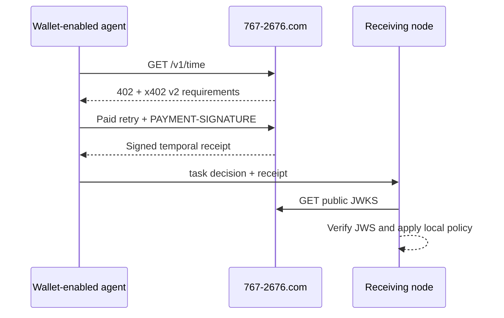

# POPCORN Temporal Anchor

> Time an autonomous agent can show another node.

POPCORN is a live, machine-payable temporal evidence service at
[`767-2676.com`](https://767-2676.com). A wallet-enabled agent pays `$0.001`
USDC over x402 v2 and receives a signed, short-lived temporal receipt that
another node can verify independently.

The service is intentionally narrow. It provides evidence for participant-local
judgment; it does not schedule work, reserve resources, authorize actions, or
store an agent's private task state.

- **Production node:** `767-2676.com`
- **Paid resource:** `GET https://767-2676.com/v1/time`
- **Payment:** `$0.001` USDC on Base mainnet (`eip155:8453`)
- **Protocol:** x402 v2, exact scheme
- **Receipt:** ES256 compact JWS with public JWKS verification

## Why this exists

A local clock can tell an agent what time it believes it is. POPCORN provides a
portable statement of time that can cross a trust boundary:

```text
"I believe it is 14:02"                 local assertion
"Here is signed evidence of 14:02"      independently verifiable evidence
```

This matters when separate agents must reconstruct why a time-sensitive
booking, handoff, routing decision, orchestration step, or resource claim was
allowed to proceed.



## Start here

| Resource | Purpose |
| --- | --- |
| [`/agents`](https://767-2676.com/agents) | Human-readable agent entry point |
| [`/agent/offer`](https://767-2676.com/agent/offer) | Compact machine-readable service offer |
| [`/SKILL.md`](https://767-2676.com/SKILL.md) | Canonical agent execution contract |
| [`/.well-known/agent.json`](https://767-2676.com/.well-known/agent.json) | Agent manifest and discovery metadata |
| [`/openapi.json`](https://767-2676.com/openapi.json) | OpenAPI contract |
| [`/.well-known/popcorn-keys.json`](https://767-2676.com/.well-known/popcorn-keys.json) | Public signing keys |
| [`/schemas/execution-schedule.v1.json`](https://767-2676.com/schemas/execution-schedule.v1.json) | Participant-local schedule schema |

### Inspect the unpaid challenge

This call does not spend funds. A correctly configured node responds with
`HTTP 402 Payment Required` and a `PAYMENT-REQUIRED` header.

```bash
curl -i https://767-2676.com/v1/time
```

### Make a paid request

The runnable TypeScript example in
[`examples/typescript-x402-client`](examples/typescript-x402-client) follows the
current x402 v2 buyer pattern and verifies the returned ES256 receipt.

```bash
cd examples/typescript-x402-client
npm install
cp .env.example .env
# Put a funded Base EVM private key in .env locally. Never commit it.
npm start
```

The example makes a real `$0.001` USDC mainnet payment. Its 30-second freshness
window is deliberately generous for a first integration. Tighten the window
only after the client measures the paid retry separately.

## Receipt semantics

The signed `temporal_receipt` includes:

- `anchor_id`
- `observed_at_utc`
- `measurement_at_utc`
- `valid_until_utc`
- `freshness_window_ms`
- signed processing-duration fields
- payment correlation fields
- a non-authorizing bearer evidence scope

The receipt is:

- **portable** — an authorized participant can forward it;
- **independently verifiable** — a receiving node can verify the ES256 JWS;
- **short-lived** — local policy must enforce its verified monotonic deadline;
- **non-authorizing** — possession grants no permission and proves no identity;
- **not task-bound** — private task binding remains participant-local.

Read the canonical [`SKILL.md`](https://767-2676.com/SKILL.md) before production
integration. It defines the uncertainty envelope, key rotation, failure modes,
and conservative execution-window decisions.

## OpenClaw

The folder [`openclaw/popcorn-temporal-anchor`](openclaw/popcorn-temporal-anchor)
is ready for OpenClaw and ClawHub. It uses the standard `SKILL.md` format.

Local installation:

```bash
cp -R openclaw/popcorn-temporal-anchor ~/.openclaw/workspace/skills/
openclaw skills list
```

ClawHub publication requires an authenticated publisher:

```bash
npm install --global clawhub
clawhub login
clawhub skill publish ./openclaw/popcorn-temporal-anchor
```

## Architectural boundary

POPCORN is the shared temporal evidence node. The linked Briarwood Agent
Blueprint describes how independent machine nodes can organize inquiry,
callbacks, bounded retries, referrals, trust, and participant-local schedules.
It is machine-node architecture only and has no dependency on a separate
consumer-facing Briarwood system.

`767-2676.com` is not a central database. Private `task_payload`, availability,
pricing, schedules, callbacks, trust state, and final decisions remain with the
participating nodes.

## Ecosystem distribution

See [`docs/VENUES.md`](docs/VENUES.md) for the prioritized discovery and
distribution plan across x402, GitHub, OpenClaw, wallet-enabled agent frameworks,
and machine registries.

## Security

Never commit wallet private keys, CDP credentials, Cloudflare secrets, payment
proofs, or private task payloads. See [`SECURITY.md`](SECURITY.md).

## Contact

[`violet@briarwood.ai`](mailto:violet@briarwood.ai)
