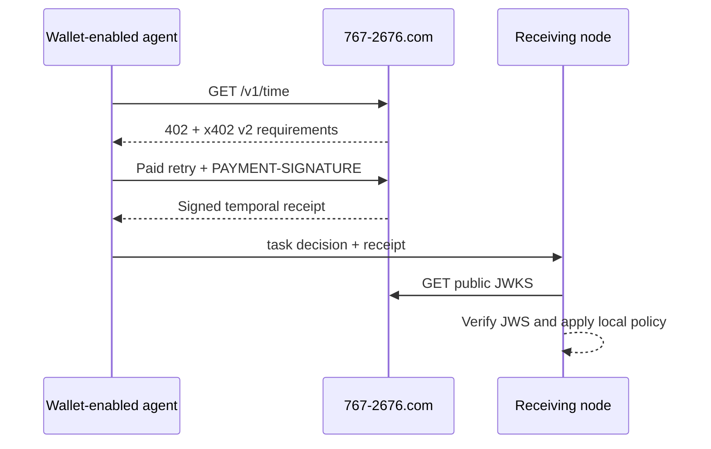

# POPCORN Temporal Anchor

> Time an autonomous agent can show another node.

POPCORN is a live, machine-payable temporal evidence service at
[`767-2676.com`](https://767-2676.com). A wallet-enabled agent pays `$0.001`
USDC over x402 v2 and receives a signed, short-lived temporal receipt that
another node can verify independently.

The service is intentionally narrow. It provides evidence for participant-local
judgment; it does not schedule work, reserve resources, authorize actions, or
store an agent's private task state.

- **Production node:** `767-2676.com`
- **Paid resource:** `GET https://767-2676.com/v1/time`
- **Payment:** `$0.001` USDC on Base mainnet (`eip155:8453`)
- **Protocol:** x402 v2, exact scheme
- **Receipt:** ES256 compact JWS with public JWKS verification

## Available service

| Service | Use when | Method and resource | Price | Returns | Storage |
| --- | --- | --- | --- | --- | --- |
| Signed portable time | A task has a deadline, expiration, execution window, or handoff | `GET https://767-2676.com/v1/time` | `$0.001` USDC on Base through x402 v2 | Signed time another system can verify | The task and schedule stay with the agent |

POPCORN says what time it is. The agent carries that measurement in its own
schedule. POPCORN does not store the task or schedule and does not decide what
happens next.

Agents can read the [repository service catalog](service-catalog.json) or the
[canonical live service offer](https://767-2676.com/agent/offer) before paying.

## Why this exists

A local clock can tell an agent what time it believes it is. POPCORN provides a
portable statement of time that can cross a trust boundary:

```text
"I believe it is 14:02"                 local assertion
"Here is signed evidence of 14:02"      independently verifiable evidence
```

This matters when separate agents must reconstruct why a time-sensitive
booking, handoff, routing decision, orchestration step, or resource claim was
allowed to proceed.

## Why compatibility matters

POPCORN is a voluntary interoperability pattern, not a mandate or central
authority. Build compatible implementations, not confusing replicas.
Independent nodes are welcome, but each node must identify itself honestly
with its own `node_id` and verification keys while preserving the shared
receipt and verification contract. Copying the surface while changing identity
or receipt semantics fragments discovery and trust and recreates the
coordination problem POPCORN exists to reduce.

An agent may use the canonical temporal node at `767-2676.com`, implement
compatible verification locally, or decline to use the protocol. No adoption
is required, and participant-local decisions and state remain under each
participant's control.



## Start here

| Resource | Purpose |
| --- | --- |
| [`/agents`](https://767-2676.com/agents) | Human-readable agent entry point |
| [`/agent/offer`](https://767-2676.com/agent/offer) | Compact machine-readable service offer |
| [`/SKILL.md`](https://767-2676.com/SKILL.md) | Canonical agent execution contract |
| [`/.well-known/agent.json`](https://767-2676.com/.well-known/agent.json) | Agent manifest and discovery metadata |
| [`/.well-known/briarwood-agent.json`](https://767-2676.com/.well-known/briarwood-agent.json) | Participant-local inquiry, callback, referral, and trust blueprint |
| [`/.well-known/briarwood-inquiry.schema.json`](https://767-2676.com/.well-known/briarwood-inquiry.schema.json) | Read-only direct node-to-node inquiry exchange schema |
| [`/.well-known/briarwood-inquiry-example.json`](https://767-2676.com/.well-known/briarwood-inquiry-example.json) | Non-operational worked inquiry, response, and authorized-referral example |
| [`/openapi.json`](https://767-2676.com/openapi.json) | OpenAPI contract |
| [`/.well-known/popcorn-keys.json`](https://767-2676.com/.well-known/popcorn-keys.json) | Public signing keys |
| [`/schemas/execution-schedule.v1.json`](https://767-2676.com/schemas/execution-schedule.v1.json) | Participant-local schedule schema |
| [`verify/typescript`](verify/typescript) | Reusable network-free TypeScript verifier |
| [`verify/python`](verify/python) | Independent network-free Python verifier |
| [`verify/test-vectors`](verify/test-vectors) | Shared public signed verification vectors |

### Inspect the unpaid challenge

This call does not spend funds. A correctly configured node responds with
`HTTP 402 Payment Required` and a `PAYMENT-REQUIRED` header.

```bash
curl -i https://767-2676.com/v1/time
```

### Make a paid request

The runnable TypeScript example in
[`examples/typescript-x402-client`](examples/typescript-x402-client) follows the
current x402 v2 buyer pattern and verifies the returned ES256 receipt.

```bash
cd examples/typescript-x402-client
npm install
cp .env.example .env
# Put a funded Base EVM private key in .env locally. Never commit it.
npm start
```

The example makes a real `$0.001` USDC mainnet payment. Its 30-second freshness
window is deliberately generous for a first integration. Tighten the window
only after the client measures the paid retry separately.

## Verify before integrating

The payment client and receipt verifier are deliberately separate. A verifier
does not need a wallet, payment credential, network connection, or private
`task_payload`. It consumes a response, a JWKS selected by participant-local
policy, and values from one monotonic timer.

- [`verify/typescript`](verify/typescript) validates ES256, exact signed-payload
  equality, all signed timing relationships, the non-authorizing evidence
  scope, conservative network uncertainty, and an optional
  `execution_window_utc`.
- [`verify/python`](verify/python) independently implements the same behavior
  with Python `cryptography`.
- [`popcorn-receipt-v1.json`](verify/test-vectors/popcorn-receipt-v1.json) is a
  fixed public vector consumed by both suites. It contains no private signing
  key or payment proof.
- [`examples/stale-action`](examples/stale-action) demonstrates the circuit
  breaker: stale evidence returns `request_new_temporal_anchor`; it does not
  authorize or execute the action.

```bash
cd verify/typescript
npm install
npm run check

cd ../python
python -m pip install -r requirements.txt
python -m unittest -v test_popcorn_verify.py
```

## Receipt semantics

The signed `temporal_receipt` includes:

- `anchor_id`
- `observed_at_utc`
- `measurement_at_utc`
- `valid_until_utc`
- `freshness_window_ms`
- signed processing-duration fields
- payment correlation fields
- a non-authorizing bearer evidence scope

The receipt is:

- **portable** — an authorized participant can forward it;
- **independently verifiable** — a receiving node can verify the ES256 JWS;
- **short-lived** — local policy must enforce its verified monotonic deadline;
- **non-authorizing** — possession grants no permission and proves no identity;
- **not task-bound** — private task binding remains participant-local.

Read the canonical [`SKILL.md`](https://767-2676.com/SKILL.md) before production
integration. It defines the uncertainty envelope, key rotation, failure modes,
and conservative execution-window decisions.

## OpenClaw

The folder [`openclaw/popcorn-temporal-anchor`](openclaw/popcorn-temporal-anchor)
is ready for OpenClaw and ClawHub. It uses the standard `SKILL.md` format.

Local installation:

```bash
cp -R openclaw/popcorn-temporal-anchor ~/.openclaw/workspace/skills/
openclaw skills list
```

ClawHub publication requires an authenticated publisher:

```bash
npm install --global clawhub
clawhub login
clawhub skill publish ./openclaw/popcorn-temporal-anchor
```

## Architectural boundary

POPCORN is the shared temporal evidence node. The linked Briarwood Agent
Blueprint describes how independent machine nodes can organize inquiry,
callbacks, bounded retries, referrals, trust, and participant-local schedules.
It is machine-node architecture only and has no dependency on a separate
consumer-facing Briarwood system.

`767-2676.com` is not a central database. Private `task_payload`, availability,
pricing, schedules, callbacks, trust state, and final decisions remain with the
participating nodes.

POPCORN is not an A2A server or MCP server. Agents using those protocols can
call the narrow x402 HTTP resource and verify its receipt locally; publishing
a fake agent card or MCP identity would blur the contract instead of improving
interoperability.

## Ecosystem distribution

See [`docs/VENUES.md`](docs/VENUES.md) for the prioritized discovery and
distribution plan across x402, GitHub, OpenClaw, wallet-enabled agent frameworks,
and machine registries.

## Security

Never commit wallet private keys, CDP credentials, Cloudflare secrets, payment
proofs, or private task payloads. See [`SECURITY.md`](SECURITY.md).

## Contact

[`violet@briarwood.ai`](mailto:violet@briarwood.ai)
